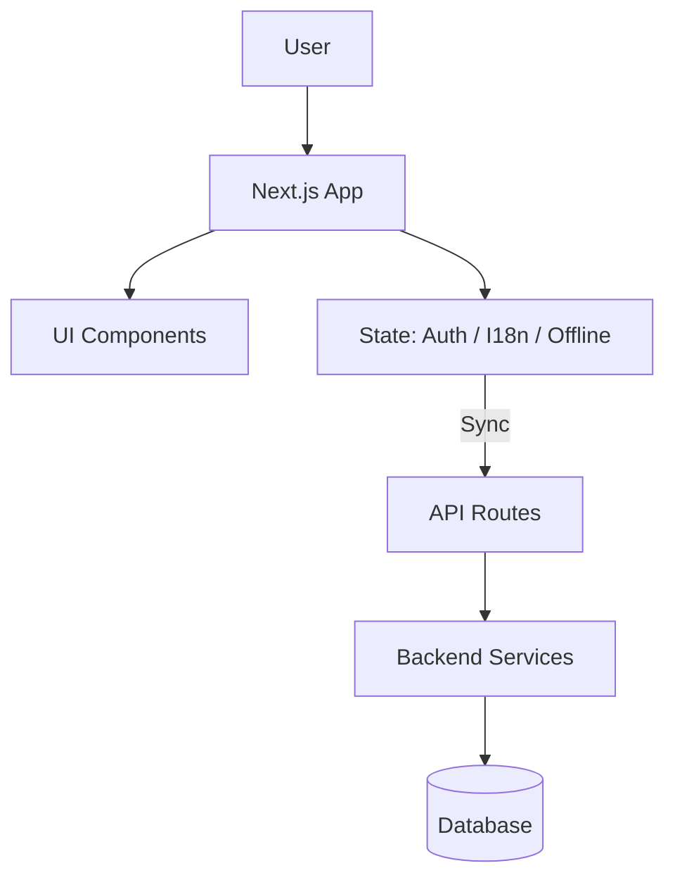
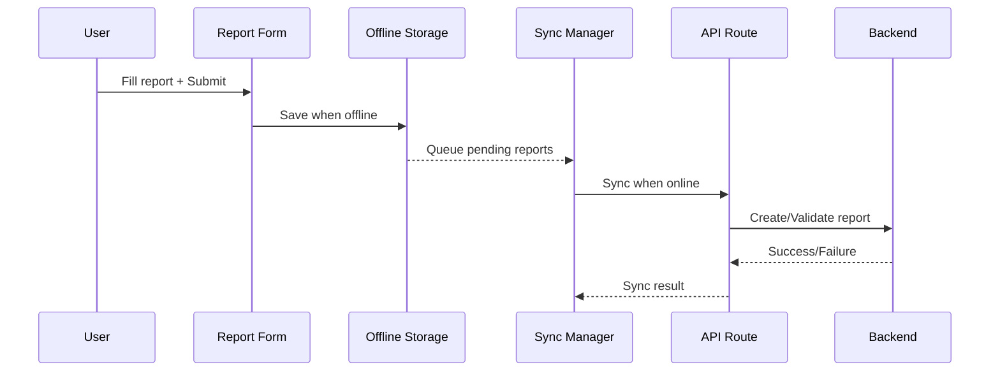

# Smart Health Monitor ("Smart Health")

A lightweight, offline-capable field reporting app for monitoring community health and water quality. Built with Next.js App Router, Tailwind CSS v4, and an ergonomic component system to help health workers collect reports even with flaky connectivity.

## Key Features
- Role-based sign-in (Admin, Health Worker) with demo accounts
- Dashboard, health report form, and alert management
- Offline-first reports with background sync when back online
- I18n with English (en) and Assamese (as)
- Dark mode, responsive UI, accessible components
- Battery-friendly animations and modern color system (OKLCH)

## Tech Stack
- Next.js 14 (App Router), React 18, TypeScript
- Tailwind CSS v4 + @tailwindcss/postcss, PostCSS, Autoprefixer
- Radix UI primitives + shadcn-inspired components
- Vercel Analytics
- pnpm for fast installs and scripts

## Quick Start
```bash
pnpm install
pnpm dev
# open http://localhost:3001
```
Demo accounts:
- Admin: admin@health.com / password
- Health Worker: worker@health.com / password

## Project Structure
```
app/            # Next.js App Router pages/layout
components/     # UI components (form, dashboard, alerts, etc.)
lib/            # auth, i18n, offline storage, sync manager, utils
backend/        # simple server-side models/controllers/services (reports)
styles/         # additional styles (if any)
```

## Architecture (High-level)


## Report Submission Flow


## Development Notes
- Tailwind v4 is enabled via `@tailwindcss/postcss` in `postcss.config.js`
- Global styles loaded in `app/layout.tsx` via `app/globals.css`
- i18n keys live in `lib/i18n.tsx`; add new keys in both languages
- Offline logic in `lib/offline-storage.ts` and `lib/sync-manager.ts`

## Scripts
- `pnpm dev` – run locally (port auto-selects if 3000 is used)
- `pnpm build` – production build
- `pnpm start` – run production build

## Roadmap
- Real authentication + persistence
- Integrate real DB + APIs for reports
- More locales and accessibility polish