# 🏥 Smart Health Monitor

<div align="center">
  
  
  **A comprehensive health monitoring and reporting system for communities**
  
  [](https://nextjs.org/)
  [](https://reactjs.org/)
  [](https://www.typescriptlang.org/)
  [](https://tailwindcss.com/)
</div>

## 📋 Overview

Smart Health Monitor is a lightweight, offline-capable field reporting application designed for monitoring community health and water quality. Built with modern web technologies, it empowers health workers to collect and manage health data even in areas with unreliable internet connectivity.

## ✨ Key Features

### 🔐 **Role-Based Access Control**
- **Admin Dashboard**: Comprehensive overview of all health reports and analytics
- **Health Worker Interface**: Streamlined form for quick data entry
- **Secure Authentication**: JWT-based login system with demo accounts

### 📱 **Offline-First Architecture**
- Reports saved locally when offline
- Automatic background sync when connection is restored
- Progressive Web App (PWA) capabilities
- Mobile-responsive design

### 🌍 **Multi-Language Support**
- English (en) and Assamese (as) language support
- Easy to extend for additional languages
- Localized UI components and content

### 🎨 **Modern User Experience**
- Dark mode and light mode support
- Accessible UI components with Radix UI
- Battery-friendly animations
- Modern color system using OKLCH
- Responsive design for all devices

### 📊 **Advanced Features**
- Real-time dashboard with analytics
- Alert management system
- Interactive map visualization
- Educational health modules
- Data export capabilities

## 🚀 Tech Stack

### Frontend
- **Next.js 14** (App Router) - React framework for production
- **React 18** - Latest React with concurrent features
- **TypeScript** - Type-safe development
- **Tailwind CSS v4** - Utility-first CSS framework
- **Radix UI** - Accessible component primitives

### Backend & Database
- **Node.js** - Server runtime
- **Express.js** - Web application framework
- **MongoDB** - Document database
- **Socket.IO** - Real-time communication

### Mobile & Native
- **Capacitor** - Cross-platform native runtime
- **Android & iOS** - Native mobile app support

### Development Tools
- **pnpm** - Fast package manager
- **PostCSS** - CSS processing
- **ESLint** - Code linting
- **Vercel Analytics** - Performance monitoring

## 🏃‍♂️ Quick Start

### Prerequisites
- Node.js 18+ installed
- npm or pnpm package manager
- MongoDB (for backend functionality)

### Installation

```bash
# Clone the repository
git clone https://github.com/AnvinX1/smart-health-app.git
cd smart-health-app

# Install dependencies
npm install
# or with pnpm
pnpm install

# Start development server
npm run dev
# or with pnpm
pnpm dev

# Open your browser
# Frontend: http://localhost:3000
```

### Demo Accounts
Use these credentials to explore the application:

| Role | Email | Password | Features |
|------|-------|----------|----------|
| **Admin** | admin@health.com | password | Full dashboard access, analytics, user management |
| **Health Worker** | worker@health.com | password | Report submission, basic dashboard view |

## 📁 Project Structure

```
📦 smart-health-app/
├── 📁 app/                     # Next.js App Router pages & layouts
│   ├── 📄 page.tsx            # Main application entry point
│   ├── 📄 layout.tsx          # Root layout with providers
│   └── 📄 globals.css         # Global styles
├── 📁 components/             # Reusable UI components
│   ├── 📄 dashboard.tsx       # Admin dashboard component
│   ├── 📄 report-form.tsx     # Health report submission form
│   ├── 📄 login-form.tsx      # Authentication component
│   ├── 📄 navigation.tsx      # Main navigation bar
│   ├── 📄 alerts-panel.tsx    # Alert management system
│   └── 📁 ui/                 # Base UI components (buttons, inputs, etc.)
├── 📁 lib/                    # Core application logic
│   ├── 📄 auth.tsx           # Authentication context & logic
│   ├── 📄 i18n.tsx           # Internationalization
│   ├── 📄 offline-storage.ts  # Local data storage
│   └── 📄 sync-manager.ts     # Online/offline sync logic
├── 📁 backend/                # Server-side application
│   ├── 📄 server.js          # Express.js server
│   ├── 📁 models/            # Database models
│   ├── 📁 routes/            # API routes
│   └── 📁 middleware/        # Custom middleware
├── 📁 AI-engine/             # AI-powered health analytics
│   ├── 📄 dashboard/         # Streamlit dashboard
│   └── 📄 models/            # Machine learning models
└── 📁 public/                # Static assets
    ├── 📄 favicon.ico
    └── 📄 placeholder-logo.svg
```

## 🏗️ Architecture Overview

```mermaid
graph TD
    A[👤 User] --> B[🌐 Next.js Frontend]
    B --> C[🔧 UI Components]
    B --> D[📊 State Management]
    D --> E[🔄 Sync Manager]
    E --> F[📡 API Routes]
    F --> G[🖥️ Backend Services]
    G --> H[🗄️ MongoDB Database]
    
    B --> I[📱 Offline Storage]
    I --> E
    
    G --> J[🤖 AI Engine]
    J --> K[📈 Analytics Dashboard]
    
    style A fill:#e1f5fe
    style B fill:#f3e5f5
    style G fill:#e8f5e8
    style H fill:#fff3e0
    style J fill:#fce4ec
```



## 📱 Application Flow

### Report Submission Process

```mermaid
sequenceDiagram
    participant 👤 User
    participant 📝 Report Form
    participant 💾 Local Storage
    participant 🔄 Sync Manager
    participant 📡 API
    participant 🗄️ Database

    👤 User->>📝 Report Form: Fill health data
    📝 Report Form->>💾 Local Storage: Save immediately
    
    alt Online Mode
        💾 Local Storage->>🔄 Sync Manager: Queue for sync
        🔄 Sync Manager->>📡 API: Submit report
        📡 API->>🗄️ Database: Store data
        🗄️ Database-->>📡 API: Confirm saved
        📡 API-->>🔄 Sync Manager: Success response
    else Offline Mode
        💾 Local Storage->>👤 User: Show "Saved locally"
        Note over 🔄 Sync Manager: Will sync when online
    end
```


## ⚙️ Available Scripts

| Command | Description | Usage |
|---------|-------------|-------|
| `npm run dev` | Start development server | Frontend only (port 3000) |
| `npm run dev:backend` | Start backend server | API server (port 5000) |
| `npm run dev:full` | Start both frontend & backend | Full stack development |
| `npm run build` | Build for production | Creates optimized build |
| `npm run start` | Start production server | Run built application |
| `npm run lint` | Run ESLint | Code quality check |
| `npm run build:mobile` | Build mobile app | Capacitor build |
| `npm run android:dev` | Run on Android | Development build |
| `npm run ios:dev` | Run on iOS | Development build |

## 🔧 Configuration

### Environment Variables
Create a `.env.local` file in the root directory:

```env
# Database
MONGODB_URI=mongodb://localhost:27017/smart-health

# Authentication
JWT_SECRET=your-secret-key
JWT_EXPIRE=7d

# Frontend
NEXT_PUBLIC_API_URL=http://localhost:5000/api

# Optional: Analytics
NEXT_PUBLIC_VERCEL_ANALYTICS=true
```

### Backend Setup
1. Navigate to backend directory: `cd backend`
2. Install dependencies: `npm install`
3. Copy environment file: `cp env.example .env`
4. Start MongoDB service
5. Run backend: `npm run dev`

## 🎯 Usage Guide

### For Health Workers
1. **Login** with health worker credentials
2. **Submit Reports** using the streamlined form
3. **View History** of submitted reports
4. **Work Offline** - reports sync automatically when online

### For Administrators
1. **Access Dashboard** with admin credentials
2. **View Analytics** and health trends
3. **Manage Alerts** and notifications
4. **Export Data** for further analysis
5. **Configure Settings** and user management

## 🤖 AI Engine Integration

The application includes an advanced AI engine for predictive health analytics:

- **Disease Outbreak Prediction** using ARIMA, Prophet, and LSTM models
- **Interactive Dashboard** with Streamlit
- **Offline Processing** capabilities
- **Integration** with main React application

To run the AI dashboard:
```bash
cd AI-engine
pip install -r requirements.txt
streamlit run dashboard/app.py
```

## 📱 Mobile Application

Built with Capacitor for cross-platform mobile deployment:

### Features
- **Native Performance** on Android and iOS
- **Offline Capability** with local data storage
- **Camera Integration** for photo capture
- **GPS Location** services
- **Push Notifications** for alerts

### Development
```bash
# Build for mobile
npm run build:mobile

# Run on Android
npm run android:dev

# Run on iOS (macOS only)
npm run ios:dev
```

## 🛠️ Development Notes

### Key Technical Details
- **Tailwind CSS v4** enabled via `@tailwindcss/postcss`
- **Global styles** loaded in `app/layout.tsx`
- **Internationalization** keys in `lib/i18n.tsx`
- **Offline logic** in `lib/offline-storage.ts` and `lib/sync-manager.ts`
- **Authentication** handled by `lib/auth.tsx` context

### Adding New Features
1. **Components**: Add to `/components` directory
2. **Pages**: Use Next.js App Router in `/app`
3. **API Routes**: Backend routes in `/backend/routes`
4. **Styling**: Use Tailwind CSS classes
5. **State**: Leverage React Context for global state

## 🚀 Deployment

### Frontend (Vercel - Recommended)
```bash
npm run build
# Deploy to Vercel, Netlify, or similar platform
```

### Backend (Docker)
```bash
cd backend
docker build -t smart-health-backend .
docker run -p 5000:5000 --env-file .env smart-health-backend
```

### Mobile Apps
1. Build production version
2. Generate signed APK/IPA files
3. Deploy to Google Play Store / Apple App Store

## 📚 Additional Documentation

- **[Setup Guide](./SETUP.md)** - Comprehensive setup instructions
- **[API Documentation](./backend/API_DOCUMENTATION.md)** - Complete API reference
- **[Capacitor Setup](./README-CAPACITOR.md)** - Mobile app configuration
- **[AI Engine Guide](./AI-engine/README.md)** - AI features documentation

## 🗺️ Roadmap

### Short Term
- [ ] Enhanced authentication with OAuth providers
- [ ] Real-time notifications via WebSockets
- [ ] Advanced data visualization
- [ ] Bulk data import/export

### Long Term
- [ ] Multi-tenant architecture
- [ ] Advanced AI health predictions
- [ ] Wearable device integration
- [ ] Telemedicine features
- [ ] Blockchain for data integrity

## 🤝 Contributing

We welcome contributions! Please follow these steps:

1. **Fork** the repository
2. **Create** a feature branch (`git checkout -b feature/amazing-feature`)
3. **Commit** your changes (`git commit -m 'Add amazing feature'`)
4. **Push** to the branch (`git push origin feature/amazing-feature`)
5. **Open** a Pull Request

## 📄 License

This project is licensed under the MIT License - see the [LICENSE](LICENSE) file for details.

## 🆘 Support

- **Documentation**: Check the guides in this repository
- **Issues**: Create an issue on GitHub
- **Community**: Join our community discussions

---

<div align="center">
  <p>Built with ❤️ for healthier communities</p>
  <p>
    <a href="#-overview">Overview</a> •
    <a href="#-quick-start">Quick Start</a> •
    <a href="#-project-structure">Structure</a> •
    <a href="#-contributing">Contributing</a>
  </p>
</div>